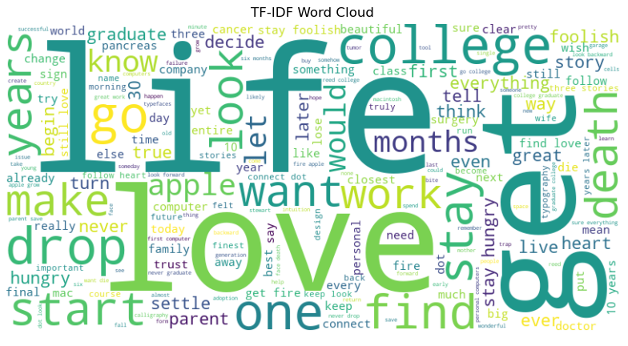

# 📌 Text Preprocessing & TF-IDF Visualization

## 📖 Overview
This repository contains a **Natural Language Processing (NLP) pipeline** for text preprocessing and TF-IDF vectorization. The project includes **tokenization, stopword removal, lemmatization, stemming, and TF-IDF transformation**, along with data visualization techniques such as heatmaps, bar charts, and PCA scatter plots.

## ✨ Features
- **Tokenization**: Sentence and word-level tokenization using `nltk`
- **Text Cleaning**: Lowercasing, stopword removal, lemmatization, and stemming
- **TF-IDF Vectorization**: Converting text data into numerical representations
- **Visualization**:
  - Heatmap of TF-IDF scores
  - Bar chart of the most important words
  - PCA scatter plot for dimensionality reduction
  - Word cloud of high-TFIDF words
- **Flexible Pipeline**: Easy to adapt for various NLP applications

## 📂 Folder Structure
```
├── data/                    # Dataset (if applicable)
├── notebooks/               # Jupyter Notebooks with preprocessing & visualization
│   ├── text_preprocessing.ipynb  # Main notebook
├── scripts/                 # Python scripts for automation
│   ├── preprocess.py        # Preprocessing functions
│   ├── tfidf_visualization.py  # Visualization scripts
├── README.md                # Documentation
```

## 🚀 Installation
### 1️⃣ Clone the Repository
```bash
git clone https://github.com/your-username/your-repo-name.git
cd your-repo-name
```

### 2️⃣ Install Dependencies
```bash
pip install -r requirements.txt
```
_(Ensure `nltk`, `sklearn`, `matplotlib`, and `seaborn` are installed.)_

### 3️⃣ Download NLTK Resources
```python
import nltk
nltk.download('punkt')
nltk.download('stopwords')
nltk.download('wordnet')
```

## 📊 Usage
### Run the Jupyter Notebook
```bash
jupyter notebook notebooks/text_preprocessing.ipynb
```

### Or Run the Preprocessing Script
```bash
python scripts/preprocess.py
```

## 📈 Example Outputs
- **TF-IDF Heatmap:** Shows word importance across sentences.
- **Bar Chart:** Highlights top TF-IDF words.
- **PCA Scatter Plot:** Visualizes high-dimensional data in 2D.
- **Word Cloud:** Displays frequently important words.

### **TF-IDF Word Cloud**


## 🛠 Future Improvements
- Add Named Entity Recognition (NER)
- Implement LDA-based topic modeling
- Enhance visualizations with interactive plots (Plotly, Bokeh)
- Integrate with deep learning models (BERT, GPT-based embeddings)

## 📜 License
This project is licensed under the **MIT License**.

## 🤝 Contributing
Feel free to **fork** this repository, **create a new branch**, and submit a **pull request** with improvements!

## ⭐ Acknowledgments
- Inspired by **Steve Jobs' Speech** as the dataset.
- Uses **NLTK, Scikit-Learn, Matplotlib, Seaborn, WordCloud**.

## 📬 Contact
For questions or suggestions, open an **issue** or reach out via **[LinkedIn](https://www.linkedin.com/in/irahulgaur)**.

---
_If you found this project useful, consider giving it a ⭐ on GitHub!_ 🚀
